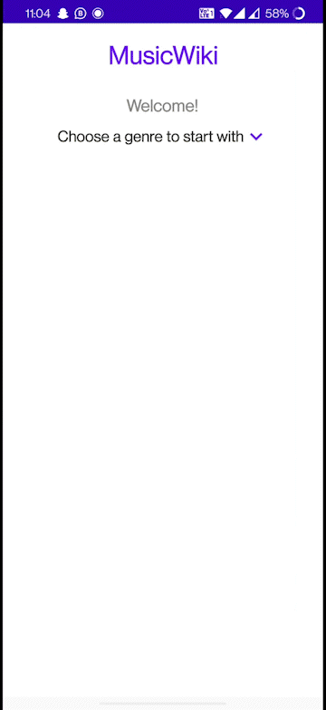

# MusicWiki
MusicWiki is an app uses Last.fm API created with Kotlin. It provides information about various music genres, as well as the albums, artists, and tracks listed under each genre. To asynchronously call the API and display the data on the app, the app employs MVVM architecture.

## Table of Contents

* Features
* Technologies Used
* Architecture and Design Pattern
* Concepts Used
* Decisions and Assumptions
* Working of the App
* Contributing
* License

## Features
- The application uses MVVM architecturere and coroutiones to asynchronously call the API.
- It also uses Hilt-Dagger for dependency injection in the Application.
- The application starts with MainActivity which displays the genres. Clicking on the toggle icon expands the list of available genres to displays all the 
genres provided by the API.
- Clicking on any one of the genres takes you to the GenereDetailScreen which diplays information about the genre and the various Albums, Artist and Tracks
that are listed under the selected genre.
> - Each item listed under the album shows the title, artist name and the cover image if available or the default launcher image.
> - Each item listed under the artists shows the artist name and the cover image if available or the default launcher image.
> - Each item listed under tracks shows the title, artist name and the cover image if available or the default launcher image.
- On clicking on a AlbumItem the application takes the user to the AlbumDetails Activity.
> The AlbumDetails Activity displays the cover image, title and the album information which includes the the description  and the list of genres in a horizontal recyclerview. Clicking on the genre it takes you to the GenreDetail Activity as explained above and the flow continues. 
- On clicking on a Artists Item the application take you to the ArtistDetail Activity. 
> - The ArtistDetail Activity displays the image of the artist followed by the artist name and the various genres under which the artist have released their songs or albums.
> - It also displays TopTracks and TopAlbums of the artist in a horizontal recycler view which also contains the name of the track/album followed by the artist name.
> - On Clicking the genres displayed in the ArtistDetail Activity it again take you to the GenreDetailActivity of the particular genre and the flow of the application resumes as before.

## Technologies Used

* Kotlin Programming Language
* Last.fm API
* Glide Image Library
* Retrofit Library
* Android Studio

## Architecture and Design Pattern

The app uses the MVVM architecture and coroutines to asynchronously call the API. It follows the repository pattern where API calls happen through the repository, which becomes the single source of truth for the app. The ViewModels can access the repository and then provide the LiveData to the activities and fragments to observe.

## Concepts Used

* VVM Architecture
* Coroutines
* Glide Image Library
* Retrofit Library
* ViewPager and Adapter

## Decisons And Assumption
- Tried to keep the UI as minimalistic as possible due to time constraints to focus more on the Architecture of the Application.
- Used Hilt-Dagger in the code following the best practises. It reduces the development time considerably also provide clean architecture and understandable and readable code.
- Used retrofit for making Api calls.
- Experimented a little bit with UI by not using the exact colors as instructed in the assignment as i thought the present colors provide more contrast and unique look to the UI.
- Several images in  Artists, Tracks or Top Tracks section could not be loaded due to complication in the Api.

## Working of the App

